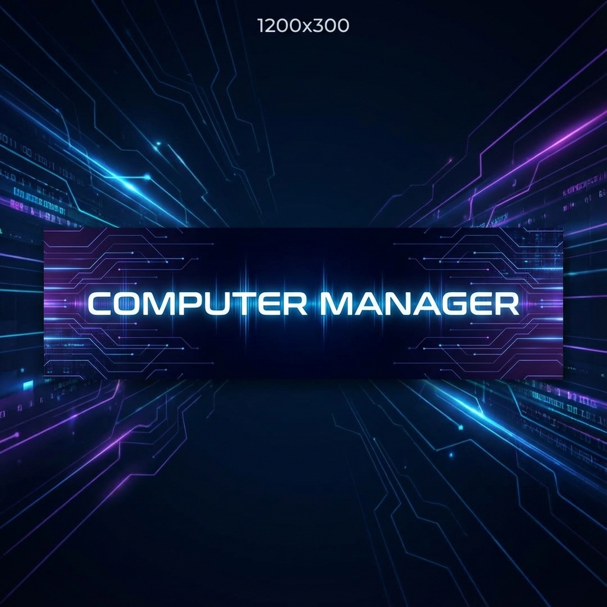

# Computer Manager - Your Private AI Desktop Assistant

**Automate your digital life without sacrificing your privacy.**

Computer Manager is a powerful, locally-installed AI agent designed to handle the boring, repetitive, and annoying tasks on your computer. Powered by local Large Language Models (LLMs) via Ollama, it sees what you see and does what you tell it to—all while ensuring **zero data leaves your machine**.

We believe in **Data Sovereignty**. We are not evil bureaucrats. We don't collect your data. We don't sell your habits. This tool is Open Source, free to use, and transparent to the core.

## 🚀 Key Features

*   **🔒 Privacy First & "Null Data" Policy**: No telemetry, no cloud processing, no spying. Your data stays on your SSD.
*   **🤖 Local AI Intelligence**: Leverages the power of Ollama (Llama 3, Mistral, Gemma) to understand natural language commands.
*   **🛠️ Agent Framework with Tool Calling**: AI can execute functions and gather system information autonomously.
*   **👁️ Visual Understanding**: Capable of "seeing" your screen to provide context-aware assistance (requires Vision models).
*   **⚡ Completely Autonomous**: Can organize files, manage system settings, and automate workflows.
*   **🐧 Cross-Platform**: Run it on Windows, Linux, or macOS.

## 🤖 Agent Capabilities

The agent framework enables the AI to use tools for enhanced functionality:

### Built-in Tools

*   **Echo Tool**: Testing and verification
*   **Get Time Tool**: Current date and time in various formats
*   **Get System Info Tool**: Hardware information (CPU, RAM, GPU, hardware tier)

### How It Works

1. You send a message to the AI
2. The AI determines which tools (if any) are needed
3. Tools are executed automatically
4. Results are fed back to the AI
5. The AI provides a final response with the gathered information

The agent can execute up to 10 tool calls in a single conversation turn, enabling complex multi-step operations.

## ✨ Optional Features

### 🔗 LangChain Integration

Unlock the power of LangChain's massive tool ecosystem (Wikipedia, DuckDuckGo Search, Calculator, etc.) by enabling this optional integration.

- **Hybrid Approach**: Combine our fast, custom agent core with LangChain's versatile tools.
- **Easy Configuration**: Enable/disable via Settings or environment variables.
- **Extensible**: Developers can easily add more LangChain tools.

See [docs/LANGCHAIN_INTEGRATION.md](docs/LANGCHAIN_INTEGRATION.md) for full details.

## 🔧 Automation Features

Computer Manager includes powerful automation capabilities through specialized tools:

### File Operations
- **Read/Write Files**: Read file contents or write/append to files with automatic directory creation
- **Delete/Move Files**: Safely delete or move files with comprehensive error handling
- **List Directories**: Browse directory contents with optional recursive listing and pattern matching
- **Search Files**: Find files by pattern with metadata (size, modified time)
- **File Information**: Get detailed metadata including permissions, timestamps, and file type

### Process Management
- **Launch Applications**: Start applications with custom arguments
- **List Processes**: View running processes with optional filtering and detailed information
- **Kill Processes**: Terminate processes by PID or name (with graceful shutdown)
- **Process Information**: Get detailed process stats including CPU, memory, and command line

### Web Browsing
- **Open URLs**: Open websites in your default browser
- **Web Search**: Search Google, Bing, or DuckDuckGo directly from commands

### Screen Capture
- **Capture Screenshots**: Take full screen or region screenshots with customizable quality
- **Get Screen Size**: Retrieve screen dimensions for coordinate calculations
- **Locate Images**: Find UI elements on screen using image recognition
- **Get Pixel Color**: Sample colors at specific screen coordinates for automation logic

### Keyboard & Mouse Control
- **Move Mouse**: Move cursor to absolute or relative coordinates with smooth animation
- **Click Mouse**: Perform single, double, or triple clicks with any mouse button
- **Scroll Mouse**: Scroll up or down at current or specified position
- **Type Text**: Type text with configurable keystroke intervals
- **Press Keys**: Press special keys (Enter, Tab, arrows, function keys, etc.)
- **Execute Hotkeys**: Trigger keyboard shortcuts (Ctrl+C, Alt+Tab, etc.)
- **Drag Mouse**: Perform drag-and-drop operations

**Safety Features**: All automation tools include failsafe mechanism (move mouse to corner to abort), automatic delays, coordinate validation, and comprehensive logging.

### Example Commands
- *"Create a file called notes.txt with my meeting notes"*
- *"List all Python files in my projects directory"*
- *"Launch notepad"*
- *"Show me all running Chrome processes"*
- *"Search Google for Python automation tutorials"*
- *"Open https://github.com in my browser"*
- *"Take a screenshot of my screen"*
- *"Click at position 500, 300"*
- *"Type 'Hello World' and press Enter"*
- *"Press Ctrl+C to copy"*

**Security Note**: File operations validate paths and handle permissions errors gracefully. High-risk operations should be reviewed before execution. Keyboard/mouse automation includes failsafe protection.

### Creating Custom Tools

Developers can extend functionality by creating custom tools. See [docs/AGENT_ARCHITECTURE.md](docs/AGENT_ARCHITECTURE.md) for the complete guide.

## ✊ Why Computer Manager?

In an era where every "AI" tool demands your personal data as payment, Computer Manager stands apart.
*   **For the Paranoid**: We built this because we don't trust big tech either.
*   **For the Power User**: Automate complex file operations with a single sentence.
*   **For the Lazy**: "Clean up my Downloads folder" should be a voice command, not a 20-minute chore.

## 🛠️ Hardware Requirements

Since this runs **locally**, your hardware dictates performance.

| Level | RAM | Recommended Model | Use Case |
| :--- | :--- | :--- | :--- |
| **Minimum** (<8GB) | <8GB | Phi-3 3B / Llama 3.2 3B | Basic text commands, no vision |
| **Recommended** | 8-16GB | Mistral 7B / Qwen2.5-VL 7B | Standard automation with vision |
| **Powerhouse** | 16GB+ | Llama 3.1 70B / Qwen2.5-VL 72B | Complex reasoning & High-res Vision |

## 📦 Prerequisites

1.  **Ollama**: The heart of the operation.
    *   Windows/Mac: [Download from ollama.com](https://ollama.com)
    *   Linux: `curl -fsSL https://ollama.com/install.sh | sh`
2.  **Modern OS**: Windows 10/11, macOS 12+, or a modern Linux distro.
3.  **Platform-Specific Dependencies**:
    *   **Linux**: `sudo apt-get install python3-tk python3-dev` (required for PyAutoGUI)
    *   **macOS**: May require accessibility permissions in System Preferences → Security & Privacy → Privacy → Accessibility (for keyboard/mouse automation)

## 💾 Installation

### Option 1: Download Pre-built Binaries (Recommended)

Download the latest release for your platform from the [Releases](https://github.com/zarigata/ComputerManager/releases) page.

#### Windows
1. Download `ComputerManager-Windows-x64.exe`
2. Double-click to run (Windows Defender may show a warning - click "More info" → "Run anyway")
3. The application will start automatically

#### Linux
1. Download `ComputerManager-Linux-x64`
2. Make it executable: `chmod +x ComputerManager-Linux-x64`
3. Run: `./ComputerManager-Linux-x64`
4. **Dependencies**: Install system dependencies first:
   ```bash
   sudo apt-get update
   sudo apt-get install python3-tk python3-dev libxcb-xinerama0
   ```

#### macOS
1. Download `ComputerManager-macOS-x64.dmg`
2. Open the DMG and drag Computer Manager to Applications
3. Right-click the app and select "Open" (first time only, due to Gatekeeper)
4. Grant accessibility permissions when prompted (System Preferences → Security & Privacy → Privacy → Accessibility)

### Option 2: The "Hacker Way" (Source)

```bash
# 1. Clone the repo (you know the drill)
git clone https://github.com/zarigata/ComputerManager.git
cd ComputerManager

# 2. Set up your environment
### Running from Source

If you prefer to run from source or encounter issues with the executable:

1.  Run the `run.bat` script in the project root.
    *   This will automatically set up the environment and start the application.

Or manually:
```bash
# Create and activate virtual environment
python -m venv venv
# Windows:
venv\Scripts\activate
# Linux/Mac:
source venv/bin/activate

# 4. Install dependencies
# Standard installation:
pip install -r requirements.txt

# With LangChain support (Optional):
pip install -e .[langchain]

# 5. Launch the Matrix
python src/main.py
```

### Manual Model Installation
If auto-download fails, you can install recommendations manually:

```bash
# Medium Tier (8-16GB RAM)
ollama pull mistral:7b-instruct-q4_K_M
ollama pull qwen2.5-vl:7b-instruct-q4_K_M

# Low Tier (<8GB RAM)
ollama pull phi3:3b-mini-instruct-q4_K_M
ollama pull llama3.2-vision:11b-instruct-q4_K_M
```

## ❓ Troubleshooting

*   **Ollama Connection Failed**: Ensure Ollama is running (`ollama serve`) and reachable at `http://localhost:11434`.
*   **Model Not Found**: Check if `model_quantization` in `.env` matches what is on Ollama registry. Default is `Q4_K_M`.
*   **Download Stuck**: Large models (70B+) can take hours. Use manual `ollama pull` in terminal to see progress bar.

### Binary-Specific Issues

#### Windows
- **"Windows protected your PC" warning**: Click "More info" → "Run anyway". This is normal for unsigned executables.
- **Antivirus false positive**: Add exception for ComputerManager.exe in your antivirus software.
- **Missing DLL errors**: Install [Visual C++ Redistributable](https://aka.ms/vs/17/release/vc_redist.x64.exe)

#### Linux
- **"error while loading shared libraries"**: Install missing system libraries:
  ```bash
  sudo apt-get install libxcb-xinerama0 libxcb-cursor0 libxkbcommon-x11-0
  ```
- **Permission denied**: Ensure executable flag is set: `chmod +x ComputerManager-Linux-x64`
- **AppImage not running**: Install FUSE: `sudo apt-get install fuse libfuse2`

#### macOS
- **"App is damaged and can't be opened"**: Remove quarantine attribute:
  ```bash
  xattr -cr /Applications/ComputerManager.app
  ```
- **Accessibility permissions**: Go to System Preferences → Security & Privacy → Privacy → Accessibility, and add Computer Manager
- **"App is from an unidentified developer"**: Right-click → Open (first time only)

## ⚙️ Configuration

Copy `.env.example` to `.env` and tweak to your liking.

```env
# Point this to your local Ollama instance
OLLAMA_HOST=http://localhost:11434

# Choose your weapon (Model)
DEFAULT_TEXT_MODEL=llama3
DEFAULT_VISION_MODEL=llava

# Agent Configuration
AGENT_ENABLED=true
AGENT_MAX_ITERATIONS=10
TOOL_EXECUTION_TIMEOUT=30

# Safety First
REQUIRE_CONFIRMATION=true
```

## 🎮 Usage

1.  Ensure **Ollama** is running (`ollama serve`).
2.  Run **Computer Manager**.
3.  Type naturally:
    *   *"Sort my Downloads folder by date"*
    *   *"Find all duplicate images in Pictures"*
    *   *"Close all Chrome tabs that are playing audio"* (Coming soon)
    *   *"Take a look at this error message and tell me how to fix it"*

## 🛡️ Security

Computer Manager implements a comprehensive security system to protect you from unintended or malicious actions.

### Permission Levels

Choose your security level based on trust and use case:

| Level | Access | Use Case |
|-------|--------|----------|
| **Basic** | Read-only operations (files, processes, screen) | Safe exploration without system changes |
| **Advanced** | File writes, automation, app launching | Productivity automation with controlled access |
| **Admin** | System modifications, deletions, service control | Full system administration |

### Security Features

*   **🔐 Permission Enforcement**: Three-tier access control prevents unauthorized operations
*   **✅ User Confirmations**: Interactive approval required for sensitive actions (file deletion, process termination, etc.)
*   **📋 Audit Logging**: Complete history of all AI actions with timestamps and parameters
*   **🔑 Privilege Elevation**: Platform-specific UAC/sudo integration for admin operations
*   **🛡️ Parameter Sanitization**: Passwords and tokens are automatically redacted from logs
*   **⏱️ Decision Caching**: Remember confirmation choices for repeated operations

### Configuration

```env
# Security Configuration
PERMISSION_LEVEL=advanced          # basic, advanced, or admin
REQUIRE_CONFIRMATION=true          # Require approval for sensitive actions
ENABLE_AUDIT_LOG=true             # Log all AI actions
AUDIT_LOG_PATH=logs/audit.log     # Where to store audit logs
```

### Audit Log Viewer

Access the audit log viewer from Settings → Security tab to:
- View all AI actions with timestamps
- Filter by tool name, date range, or status
- Export logs to JSON or CSV
- Clear logs with automatic backup

### Platform-Specific Privilege Elevation

- **Windows**: UAC prompt for administrator access
- **Linux**: sudo authentication for root operations
- **macOS**: Native authentication dialog via osascript

For detailed security architecture and troubleshooting, see [docs/SECURITY.md](docs/SECURITY.md).

**Privacy Guarantee**: All security checks happen locally. No data leaves your machine.

## 🤝 Contributing

We welcome fellow code-wizards. Check out [CONTRIBUTING.md](CONTRIBUTING.md) to join the resistance.

## 📄 License

MIT License. Free forever.

---
*Generated with ❤️ and 0% spyware.*
