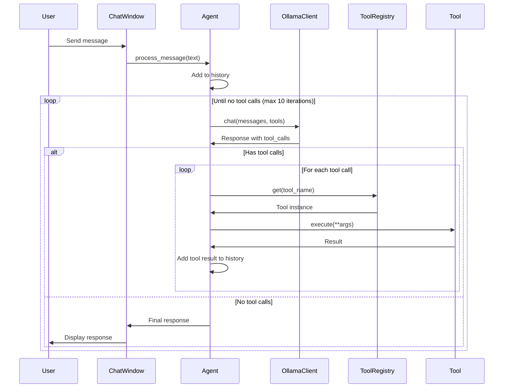

# Agent Architecture

## Overview

The Computer Manager agent framework provides tool-calling capabilities for the AI assistant, enabling it to execute functions and gather information from the system. The framework uses a lightweight, extensible architecture with support for custom tools.

## Architecture



## Components

### Tool Registry

The `ToolRegistry` manages all available tools and provides schemas for the LLM:

- **Registration**: Tools are registered by name with duplicate checking
- **Schema Generation**: Converts tools to Ollama-compatible function schemas
- **Singleton Pattern**: Global registry accessible via `get_tool_registry()`

### Base Tool

`BaseTool` provides the foundation for all tools:

```python
class BaseTool(ABC):
    @property
    @abstractmethod
    def name(self) -> str: ...
    
    @property
    @abstractmethod
    def description(self) -> str: ...
    
    @property
    @abstractmethod
    def parameters(self) -> Dict[str, Any]: ...
    
    @abstractmethod
    async def execute(self, **kwargs) -> Any: ...
```

### Agent Core

The `Agent` class orchestrates tool execution:

1. Receives user message
2. Calls LLM with available tools
3. Detects tool calls in response
4. Executes tools and adds results to conversation
5. Repeats until LLM provides final answer (max 10 iterations)

## Built-in Tools

### Echo Tool
- **Purpose**: Testing and verification
- **Parameters**: `message` (string)
- **Returns**: The input message

### Get Time Tool
- **Purpose**: Current date/time
- **Parameters**: `format` (iso/readable/timestamp)
- **Returns**: Formatted time string

### Get System Info Tool
- **Purpose**: Hardware information
- **Parameters**: `detailed` (boolean)
- **Returns**: CPU, RAM, GPU details and hardware tier

## Creating Custom Tools

### Basic Tool Example

```python
from src.agent import BaseTool, get_tool_registry

class MyCustomTool(BaseTool):
    @property
    def name(self) -> str:
        return "my_tool"
    
    @property
    def description(self) -> str:
        return "Description for the LLM"
    
    @property
    def parameters(self):
        return {
            'type': 'object',
            'properties': {
                'param1': {
                    'type': 'string',
                    'description': 'Parameter description'
                }
            },
            'required': ['param1']
        }
    
    async def execute(self, **kwargs):
        self.validate_params(**kwargs)
        # Your tool logic here
        return result

# Register the tool
registry = get_tool_registry()
registry.register(MyCustomTool())
```

### Parameter Schema

Tools use OpenAPI-style JSON schemas:

```python
{
    'type': 'object',
    'properties': {
        'param_name': {
            'type': 'string',  # string, number, integer, boolean, array, object
            'description': 'Description for LLM',
            'default': 'optional_default',
            'enum': ['option1', 'option2']  # Optional
        }
    },
    'required': ['param_name']  # Required parameters
}
```

## Configuration

Agent behavior is configured via environment variables:

| Variable | Default | Description |
|----------|---------|-------------|
| `AGENT_ENABLED` | `true` | Enable/disable agent mode |
| `AGENT_MAX_ITERATIONS` | `10` | Max tool execution loops |
| `AGENT_SYSTEM_PROMPT` | Auto | Custom system prompt |
| `TOOL_EXECUTION_TIMEOUT` | `30` | Tool timeout (seconds) |

## Integration

### Chat Window Integration

The `ChatWindow` supports both agent and direct modes:

```python
# Agent mode (with tools)
chat_window = ChatWindow(ollama_client, agent=agent)

# Direct mode (streaming only)
chat_window = ChatWindow(ollama_client)
```

### Main Application

Initialize the agent in `main.py`:

```python
from src.agent import Agent, get_tool_registry, initialize_builtin_tools

# Initialize built-in tools
initialize_builtin_tools()

# Create agent
registry = get_tool_registry()
agent = Agent(
    ollama_client=ollama_client,
    tool_registry=registry,
    model=config.default_text_model
)
```

## Error Handling

The agent handles errors gracefully:

- **Missing Tools**: Reports error to LLM, continues conversation
- **Tool Execution Errors**: Catches exceptions, formats as tool result
- **Max Iterations**: Returns helpful message after 10 loops
- **Connection Errors**: Propagates to chat window for user notification

## Future Enhancements

### LangChain Integration (Planned)

Optional LangChain support for advanced features:

- Memory management
- Chain composition
- Additional tool libraries
- Prompt templates

This will be implemented as an optional dependency, maintaining the lightweight core.
