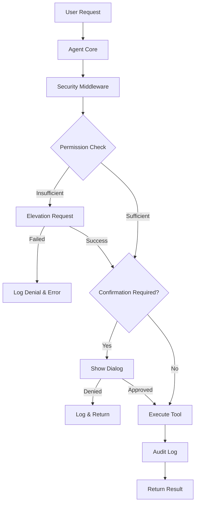

# Security Architecture

This document describes the security architecture of Computer Manager, including permission management, audit logging, and privilege elevation.

## Overview

Computer Manager implements a comprehensive security system to protect users from unintended or malicious actions. The security layer intercepts all tool executions and enforces:

- **Permission Levels**: Three-tier access control (Basic, Advanced, Admin)
- **User Confirmations**: Interactive approval for sensitive operations
- **Audit Logging**: Complete history of all AI actions
- **Privilege Elevation**: Platform-specific UAC/sudo integration

## Architecture Diagram



## Permission Levels

### Basic (Read-Only)
**Allowed Operations:**
- File reading (`read_file`, `list_directory`, `search_files`, `get_file_info`)
- Process information (`list_processes`, `get_process_info`)
- Screen capture (`capture_screenshot`, `get_screen_size`, `describe_screen`)
- Web browsing (`open_url`, `search_web`)
- System information (`get_system_info`)

**Use Case:** Safe exploration and information gathering without system modifications.

### Advanced (Automation)
**Allowed Operations:**
- All Basic operations
- File modifications (`write_file`, `move_file`)
- Application launching (`launch_application`)
- Keyboard/mouse automation (`click_mouse`, `type_text`, `press_key`, `hotkey`)
- Registry reading (`read_registry_key`)
- Environment variable reading (`get_environment_variable`)

**Use Case:** Productivity automation with controlled write access.

### Admin (System Control)
**Allowed Operations:**
- All Advanced operations
- File deletion (`delete_file`)
- Process termination (`kill_process`)
- Registry modifications (`write_registry_key`, `delete_registry_key`)
- System control (`windows_shutdown`, `windows_service_control`)
- Environment variable modification (`set_environment_variable`)
- Service management (`linux_systemd_control`, `macos_service_control`)

**Use Case:** Full system administration with maximum privileges.

## Tool Permission Matrix

| Tool Category | Example Tools | Required Level | Confirmation |
|--------------|---------------|----------------|--------------|
| File Reading | `read_file`, `list_directory` | BASIC | No |
| File Writing | `write_file`, `move_file` | ADVANCED | Yes |
| File Deletion | `delete_file` | ADMIN | Yes |
| Process Info | `list_processes` | BASIC | No |
| Process Control | `launch_application`, `kill_process` | ADVANCED/ADMIN | Yes |
| Automation | `click_mouse`, `type_text` | ADVANCED | Yes |
| Screen Capture | `capture_screenshot` | BASIC | No |
| Registry Read | `read_registry_key` | ADVANCED | No |
| Registry Write | `write_registry_key` | ADMIN | Yes |
| System Control | `windows_shutdown` | ADMIN | Yes |

## Privilege Elevation

### Windows (UAC)
- **Detection**: `pyuac.isUserAdmin()`
- **Elevation**: UAC prompt via `pyuac.runAsAdmin()`
- **Note**: Requires application restart with elevated privileges
- **Fallback**: Registry key access test

### Linux (sudo)
- **Detection**: `os.geteuid() == 0`
- **Elevation**: `sudo -v` for credential validation
- **GUI**: Uses `pkexec` or `gksudo` if available
- **Timeout**: 30 seconds for password entry

### macOS (osascript)
- **Detection**: `os.geteuid() == 0`
- **Elevation**: Native authentication dialog via `osascript`
- **Command**: `do shell script "sudo -v" with administrator privileges`
- **Timeout**: 30 seconds for password entry

## Audit Logging

### Log Format
Logs are stored as newline-delimited JSON with the following structure:

```json
{
  "timestamp": "2025-12-28T15:42:59-03:00",
  "event_type": "tool_execution",
  "tool_name": "delete_file",
  "parameters": {
    "path": "/path/to/file.txt"
  },
  "success": true,
  "user_confirmed": true,
  "execution_time": 0.15,
  "permission_level": "admin"
}
```

### Event Types
- **tool_execution**: Tool execution with result
- **permission_denied**: Access denied due to insufficient permissions
- **elevation_request**: Privilege elevation attempt
- **user_confirmation**: User approval/denial of action

### Log Rotation
- **Max Size**: 10MB per file
- **Backups**: 5 rotated files kept
- **Location**: Configurable via `AUDIT_LOG_PATH` (default: `logs/audit.log`)

### Sensitive Data Redaction
The following parameter keys are automatically redacted:
- `password`, `passwd`, `pwd`
- `secret`, `token`, `api_key`, `apikey`
- `auth`, `authorization`, `credential`
- `private_key`

## Confirmation Dialogs

### When Shown
Confirmations are required when:
1. `REQUIRE_CONFIRMATION=true` in config
2. Tool is marked as sensitive (contains keywords: delete, kill, shutdown, write, type, click, registry, service, system)
3. `SENSITIVE_ACTIONS_REQUIRE_CONFIRMATION=true`

### Dialog Features
- **Tool Details**: Name, parameters, sensitivity level
- **Remember Choice**: Cache decision for session (1 hour default)
- **Allow/Deny/Cancel**: Three-button interface
- **Parameter Display**: Formatted, truncated for readability

### Decision Caching
- **Duration**: 3600 seconds (1 hour) by default
- **Scope**: Per tool name
- **Clearing**: Automatic on expiry or manual via `clear_cache()`

## Configuration

### Environment Variables

```env
# Permission Level (basic, advanced, admin)
PERMISSION_LEVEL=advanced

# Require user confirmation for sensitive actions
REQUIRE_CONFIRMATION=true

# Enable audit logging
ENABLE_AUDIT_LOG=true

# Audit log file path
AUDIT_LOG_PATH=logs/audit.log

# Require confirmation for sensitive automation
SENSITIVE_ACTIONS_REQUIRE_CONFIRMATION=true
```

### Validation
Configuration is validated on startup:
- Permission level must be `basic`, `advanced`, or `admin`
- Audit log path must be writable
- Audit log directory is created if missing
- Warning if admin level set without admin privileges

## Security Best Practices

### For Users
1. **Start with Basic**: Use Basic permission level for exploration
2. **Review Audit Logs**: Regularly check what the AI has done
3. **Enable Confirmations**: Always require confirmation for sensitive actions
4. **Run as Standard User**: Avoid running as admin unless necessary
5. **Monitor Elevation Requests**: Be cautious when UAC/sudo prompts appear

### For Developers
1. **Classify Tools Correctly**: Assign appropriate permission levels
2. **Sanitize Logs**: Never log sensitive data (passwords, tokens)
3. **Handle Denials Gracefully**: Provide clear error messages
4. **Test Elevation**: Verify privilege elevation on all platforms
5. **Document Security**: Update this document when adding tools

## Troubleshooting

### Permission Denied Errors
**Symptom**: Tool execution fails with "Permission denied"
**Solution**:
- Check current permission level in settings
- Increase permission level if appropriate
- Verify admin privileges if using Admin level
- Check audit log for denial details

### Elevation Failures
**Symptom**: Privilege elevation fails or times out
**Solution**:
- **Windows**: Restart application as administrator
- **Linux**: Ensure user has sudo access (`sudo -v`)
- **macOS**: Check System Preferences > Security & Privacy
- Verify 30-second timeout hasn't expired

### Audit Log Issues
**Symptom**: Audit log not being written
**Solution**:
- Verify `ENABLE_AUDIT_LOG=true`
- Check audit log path is writable
- Ensure log directory exists
- Check disk space availability
- Review application logs for errors

### Confirmation Dialogs Not Showing
**Symptom**: Actions execute without confirmation
**Solution**:
- Verify `REQUIRE_CONFIRMATION=true`
- Check `SENSITIVE_ACTIONS_REQUIRE_CONFIRMATION=true`
- Clear decision cache in settings
- Restart application to reset cache

## Implementation Details

### Core Components

#### PermissionManager (`src/security/permissions.py`)
- Manages permission levels and tool mappings
- Handles platform-specific admin detection
- Implements privilege elevation logic

#### AuditLogger (`src/security/audit_log.py`)
- Structured JSON logging with rotation
- Sensitive data sanitization
- Log export (JSON/CSV formats)

#### ConfirmationManager (`src/security/confirmation_dialog.py`)
- PyQt6 confirmation dialogs
- Decision caching with expiry
- User-friendly parameter display

#### SecurityMiddleware (`src/security/middleware.py`)
- Intercepts tool execution
- Enforces security pipeline
- Handles exceptions and logging

### Integration Points

#### Agent Core (`src/agent/core.py`)
Security middleware is injected into the agent's tool execution pipeline:

```python
tool_result = await self.security_middleware.execute_with_security(
    tool, **arguments
)
```

#### Settings Dialog (`src/gui/settings_dialog.py`)
Security tab provides:
- Permission level selection
- Audit log viewer access
- Privilege testing
- Configuration management

#### Chat Window (`src/gui/chat_window.py`)
Status bar shows:
- Current permission level with color-coded shield icon
- Admin privilege status (Elevated indicator)
- Real-time security status updates

## Future Enhancements

- **Role-Based Access Control**: Multiple user profiles with different permissions
- **Remote Audit Log Shipping**: Send logs to external SIEM systems
- **Sandboxing**: Isolate tool execution in containers
- **Signature Verification**: Verify tool integrity before execution
- **Rate Limiting**: Prevent rapid-fire sensitive operations
- **Anomaly Detection**: ML-based detection of unusual patterns
